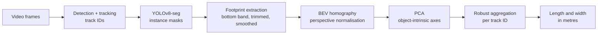

# Vehicle Dimension Estimation from Surveillance Cameras

Estimating the **length and width of vehicles** from a single fixed traffic camera, using instance segmentation, a bird's-eye-view (BEV) homography, and PCA on the vehicle's ground footprint.

Undergraduate thesis project, Data Science — Van Lang University, 2026. Graded 9.5/10. Consolation Prize, InnoX Innovation Competition 2026.


---

## The problem

A monocular surveillance camera gives you a 2D perspective image. Physical dimensions live in 3D world space. The same car looks very different in pixel size depending on where it sits in the frame.

The usual shortcut is to measure the bounding box. That fails badly: a bounding box is axis-aligned, always contains background, and stretches when the vehicle turns at an angle to the camera.

This project measures the **ground footprint** instead — the bottom edge of the segmentation mask, which is the part of the vehicle actually touching the road plane — then normalises it to a top-down view and measures along the vehicle's own axes rather than the image axes.

## Approach



Three design decisions carry most of the accuracy:

**Footprint, not full mask.** Only the lower band of the segmentation mask is kept, with both ends trimmed and the contour smoothed. Points on the roof or windshield violate the coplanarity assumption that homography depends on, so including them injects geometric error.

**PCA, not image axes.** After the footprint is warped to BEV, PCA finds the direction of maximum variance. Length and width are measured along those eigenvectors, so the measurement no longer depends on how the vehicle is rotated in the frame. A `pca_hybrid` mode blends the PCA estimate with a road-axis fallback for cases where the footprint is too isotropic for a stable principal direction.

**Aggregate over the track, not the frame.** Any single frame can have an occluded or broken mask. Each vehicle is measured across every valid frame it appears in, then reduced with robust statistics — median, MAD, IQR, trimmed mean, mode — rather than trusting one observation. Frames whose footprint is too skewed relative to the road axis are rejected outright.

## Results

Evaluated on real traffic surveillance footage from Ho Chi Minh City, against manufacturer specifications:

| Dimension | MAE (m) | RMSE (m) | MAPE |
|---|---|---|---|
| Length | 0.0753 | 0.0782 | **1.64%** |
| Width | 0.1117 | 0.1265 | 6.09% |

Per-vehicle breakdown:

| Vehicle | Reference (L × W) | Estimated (L × W) | Error |
|---|---|---|---|
| Mitsubishi Xpander | 4.475 × 1.750 | 4.578 × 1.715 | 0.103 × 0.035 |
| Honda CR-V | 4.691 × 1.866 | 4.620 × 1.746 | 0.071 × 0.120 |
| Toyota Innova | 4.735 × 1.830 | 4.683 × 1.650 | 0.052 × 0.180 |

> **Sample size is three vehicles.** These numbers demonstrate feasibility, not statistical generalisation. Width is consistently the weaker estimate — it is measured across the shorter PCA axis, where the same absolute footprint error translates into a larger relative error, and it is more sensitive to mask quality at the vehicle sides.

## Repository structure

```
src/
├── estimate_dimensions.py     # main pipeline: segmentation → footprint → BEV → PCA → per-ID summary
├── calibrate_homography.py    # interactive tool: click 4 ground points to define the BEV plane
├── filter_tracks.py           # filter a tracking JSON down to the car class by IoU matching
├── visualize_footprint.py     # render footprint overlays without measurement, for inspection
└── evaluate.py                # compare estimates against reference dimensions, compute MAE/RMSE/MAPE
docs/
└── method.md                  # geometry and derivations
```

## Installation

```bash
python -m venv .venv && source .venv/bin/activate
pip install -r requirements.txt
```

## Usage

**1 — Calibrate the road plane.** Click four coplanar points on the road surface; the tool prints the coordinates to paste into your run configuration.

```bash
python src/calibrate_homography.py --video traffic.mp4 --out roi.json
```

**2 — Restrict tracks to cars** (optional, if your tracker emits multiple classes):

```bash
python src/filter_tracks.py --video traffic.mp4 \
    --json_in tracks.json --json_out tracks_car.json
```

**3 — Measure.** The four `--src` points must correspond in order to the four `--dst` points.

```bash
python src/estimate_dimensions.py \
    --video traffic.mp4 --json tracks_car.json \
    --out annotated.mp4 \
    --src 350,1250 880,1250 171,1650 1068,1650 \
    --dst 100,500  1000,500  100,2000 1000,2000 \
    --scale_m_per_px 0.01 \
    --measurement_mode pca_hybrid \
    --classes car --summary_min_frames 6 \
    --csv per_frame.csv --summary_out summary_by_id.xlsx \
    --draw_masks --show_bev_inset \
    --out_dir ./output --run_label demo
```

Outputs an annotated video, per-frame measurements, a per-track-ID summary with robust statistics, and a `run_meta.json` recording every parameter of the run.

**4 — Evaluate against reference dimensions:**

```bash
python src/evaluate.py --est summary_by_id.xlsx \
    --gt reference_sizes.xlsx --out comparison.xlsx
```

Run `--help` on any script for the full parameter list. `estimate_dimensions.py` exposes tuning for the footprint band ratio, trim percentiles, skew rejection threshold, and PCA blend weights.

## Data

The evaluation footage is not distributed. It is real street video from Ho Chi Minh City containing identifiable licence plates and pedestrians, and redistributing it would raise privacy issues that a public repository should not create.

The pipeline works with any fixed camera where the observed road surface is approximately planar. You need a video, a tracking JSON supplying per-frame track IDs and boxes, and four calibration points on the ground.

## What is not included

The detection and tracking stage — MobileNetV2-like + SSD for detection, OSNet appearance embeddings for ID association — is a separate component and is not part of this repository. The scripts here consume track IDs through the `--json` argument and expect this format:

```json
[{"id": 1, "timestamps": [0, 1, 2], "boxes": [[x1, y1, x2, y2], "..."]}]
```

Any tracker producing per-frame IDs and boxes can be substituted.

## Limitations

Accuracy depends directly on segmentation quality; occlusion, strong shadows, and truncated masks all degrade the footprint and propagate through every downstream step. Calibration is manual and its error propagates through the entire measurement chain. The system was tuned for the `car` class — trucks and buses would need re-tuning of the footprint band and plausibility gates. Height is not estimated; this is a two-dimensional measurement on the road plane, not a 3D reconstruction.

## Citation

Nguyen, B. T. and Truong, M. H. (2026). *Applying Hybrid Segmentation–PCA to Vehicle Dimension Estimation from Surveillance Cameras.* Undergraduate thesis, Van Lang University. Supervised by Dr. Truong Quoc Tri.

## License

AGPL-3.0. This project depends on [Ultralytics YOLOv8](https://github.com/ultralytics/ultralytics), which is licensed under AGPL-3.0, and inherits its copyleft terms.
